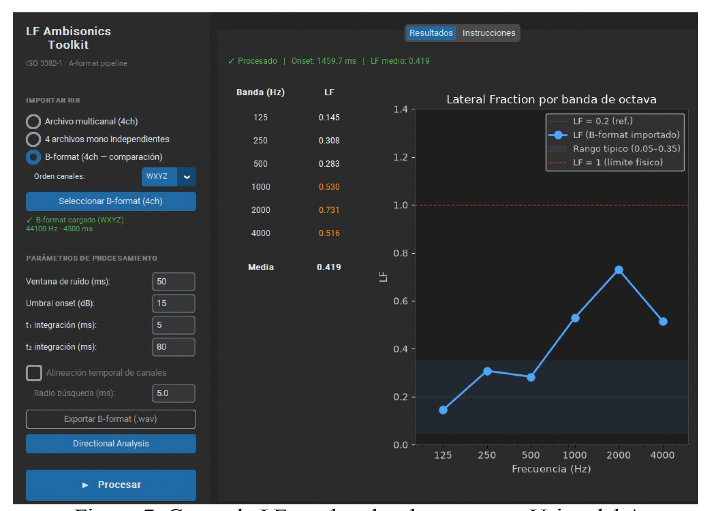
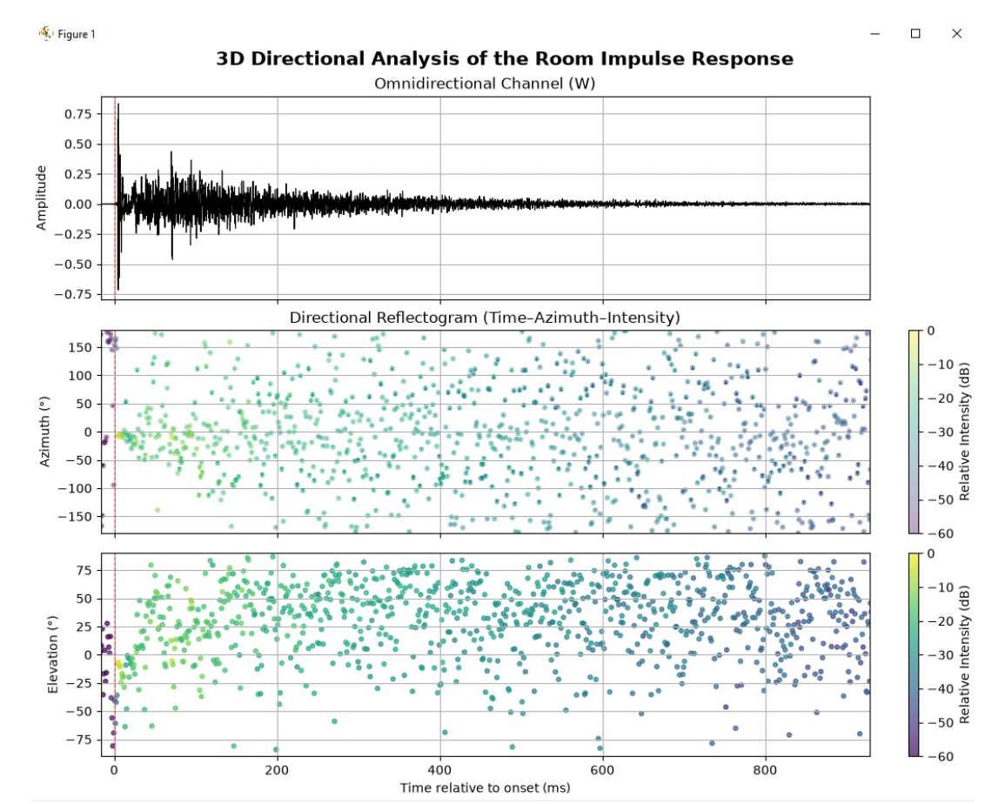

# LF Ambisonics Toolkit

> **ES** | [EN below](#english-version)

Pipeline de código abierto para el cálculo del parámetro **Lateral Fraction (LF)**
a partir de respuestas al impulso ambisónicas, con análisis direccional 3D del campo
sonoro. Implementado en Python, conforme a **ISO 3382-1**.

Desarrollado en la **Universidad Nacional de Tres de Febrero**, con vinculación a la
cátedra de **Instrumentos y Mediciones Acústicas (IMA)**. Presentado en el
**XII Congreso Iberoamericano de Acústica FIA 2026** y en la
**[AES Latin American Conference 2026](https://lac2026.aesperu.org.pe/)**.

> S. Carro · F. Parodi — UNTREF · IMA · AES · FIA 2026

---

## Capturas

| LF por banda de octava | Análisis Direccional 3D |
|:---:|:---:|
|  |  |

---

## Funcionalidades

- Importa RIRs en **Formato A** (4 mono o 4ch) o **Formato B** (4ch, WYZX o WXYZ)
- Convierte A → B con la matriz tetraédrica estándar
- Detecta automáticamente el onset (t₀) en el canal W
- Aplica filtros Butterworth ord. 3 fase cero en 6 bandas de octava (125–4000 Hz)
- Calcula **LF** por banda y media, conforme a ISO 3382-1
- Genera el **reflectograma direccional** tiempo–azimut–elevación mediante vectores de intensidad acústica activa
- Exporta resultados a CSV / JSON y B-format a WAV (orden WYZX/ACN, compatible con EASERA Aurora)

---

## Instalación

```bash
git clone https://github.com/sebascarrom/LF-ambisonics-toolkit.git
cd LF-ambisonics-toolkit
python -m venv .venv
source .venv/bin/activate       # Windows: .venv\Scripts\activate
pip install -r requirements.txt
```

---

## Uso — GUI

```bash
python gui/app.py
```

La interfaz permite importar RIRs en tres modos, ajustar parámetros de onset e
integración, y lanzar el análisis direccional con un clic.

## Uso — desde código

```python
from src.acoustic_core import (
    load_aformat_mono_files, align_aformat_channels, fine_align_channels,
    aformat_to_bformat, detect_onset_noise_floor,
    octave_band_filter, compute_LF_band, OCTAVE_BANDS_HZ,
)

signals, fs = load_aformat_mono_files({
    "LF": "data/raw/LF.wav", "RF": "data/raw/RF.wav",
    "LB": "data/raw/LB.wav", "RB": "data/raw/RB.wav",
})
aligned, _, onset = align_aformat_channels(signals, fs)
aligned_fine, _ = fine_align_channels(aligned, fs, onset)
bformat = aformat_to_bformat(aligned_fine, fs)
onset_s = detect_onset_noise_floor(bformat.W, fs)

lf_vals = {
    fc: compute_LF_band(
        octave_band_filter(bformat.W, fc, fs),
        octave_band_filter(bformat.Y, fc, fs),
        fs, onset=onset_s
    )
    for fc in OCTAVE_BANDS_HZ
}
print({fc: f"{v:.3f}" for fc, v in lf_vals.items()})
```

---

## Convención B-format

Export en orden **WYZX (ACN/AmbiX)**, compatible con EASERA Aurora:

| Canal | Señal | Rol en LF |
|:---:|:---:|:---:|
| ch0 | W — omnidireccional | denominador |
| ch1 | Y — lateral izq/der | numerador ← |
| ch2 | Z — vertical | — |
| ch3 | X — frente/atrás | — |

> ⚠️ Usar orden WXYZ (FuMa) con EASERA hace que X actúe como canal lateral → LF incorrecto.

---

## Validación

| Dataset | Δ vs. EASERA Aurora |
|---|:---:|
| Catedral Metropolitana BA (Soyuz 013A) | < 5 % · 125–2000 Hz |
| Pori Promenadikeskus (SoundField MKV) | < 5 % · 125–2000 Hz |
| Usina del Arte — G6\_SS1 (SP200) | < 15 % · todas las bandas |
| Usina del Arte — J12 (SP200) | < 14 % · todas las bandas |

Las diferencias en los datasets de Usina se deben a la conversión A→B con matriz
genérica (sin calibración de cápsula), no a un error del pipeline.

---

## Estructura del repositorio

```
LF-ambisonics-toolkit/
├── src/
│   ├── acoustic_core.py     # Módulo principal: A→B, LF, alineación, onset
│   └── io_utils.py          # Exportación CSV / JSON
├── gui/
│   └── app.py               # GUI — CustomTkinter + matplotlib
├── debug/                   # Scripts de diagnóstico y validación por posición
├── data/
│   ├── raw/                 # RIRs A-format originales
│   ├── processed/           # B-format exportado (WYZX/ACN)
│   └── results/             # Resultados LF en CSV
├── config/                  # usina_config.yaml · catedral_config.yaml
├── assets/                  # Capturas de pantalla
├── tests/                   # Tests automáticos (pytest)
└── requirements.txt
```

---

## Citar este trabajo

```
S. Carro, F. Parodi (2026). "Toolkit para el cálculo de Lateral Fraction
a partir de respuestas al impulso ambisónicas: validación y análisis
direccional del campo sonoro". XII Congreso Iberoamericano de Acústica, FIA 2026.
```

---

---

## English version

Open-source Python toolkit for computing the **Lateral Fraction (LF)** parameter
from ambisonic room impulse responses (RIRs), with 3D directional analysis of the
sound field. Compliant with **ISO 3382-1**.

Developed at **Universidad Nacional de Tres de Febrero**, with links to the
**Acoustical Measurements (IMA)** course. Presented at the
**XII Ibero-American Congress of Acoustics FIA 2026** and the
**[AES Latin American Conference 2026](https://lac2026.aesperu.org.pe/)**.

### Features

- Imports A-format RIRs (4 mono files or 4ch WAV) or B-format (4ch, WYZX or WXYZ)
- Automatic A → B conversion via standard tetrahedral matrix
- Automatic onset detection (t₀) on the W channel
- Zero-phase Butterworth order-3 octave-band filtering (125–4000 Hz)
- LF computation per band and broadband mean per ISO 3382-1
- 3D directional reflectogram (time–azimuth–elevation) via active acoustic intensity vectors
- CSV / JSON export + B-format WAV export (WYZX/ACN, EASERA Aurora compatible)

### Quick start

```bash
git clone https://github.com/sebascarrom/LF-ambisonics-toolkit.git
cd LF-ambisonics-toolkit
python -m venv .venv && source .venv/bin/activate
pip install -r requirements.txt
python gui/app.py
```

### Citation

```
S. Carro, F. Parodi (2026). "Toolkit for Lateral Fraction computation from ambisonic
room impulse responses: validation and directional sound field analysis".
XII Ibero-American Congress of Acoustics, FIA 2026.
```
